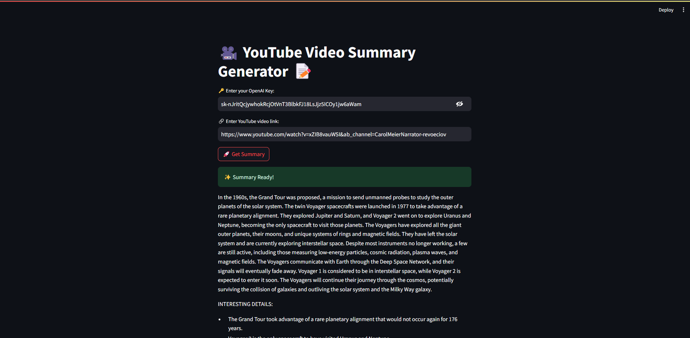

# SummarizeTubeAI

## Overview
SummarizeTubeAI is an AI-powered Streamlit application designed to provide instant summaries of YouTube videos. This tool is ideal for obtaining quick overviews of lengthy content, making it perfect for educational purposes, content analysis, and general interest. It integrates OpenAI's language models for generating concise and accurate summaries.



## Features
- **AI-Powered Summaries**: Utilizes Langchain and OpenAI's ChatGPT for summarizing YouTube video content.
- **OpenAI Key Integration**: Secure input for OpenAI API keys to leverage AI models.
- **User-Friendly Interface**: Simple and intuitive design for ease of use.
- **Progress Tracking**: Real-time progress updates while processing video summaries.

## Installation
To use SummarizeTubeAI, clone this repository and install the required dependencies.

```bash
git clone https://github.com/yourusername/SummarizeTubeAI.git
cd SummarizeTubeAI
pip install -r requirements.txt
